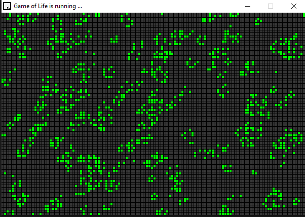

# Conway's Game of Life

Conway's Game of Life is a cellular automaton devised by the British mathematician John Horton Conway. The game is a zero-player game, meaning that its evolution is determined by its initial state, requiring no further input. One interacts with the Game of Life by creating an initial configuration and observing how it evolves.

## Overview

This implementation of Conway's Game of Life is written in C++ using the Raylib library. The game follows the basic rules of Conway's Game of Life:
- Any live cell with fewer than two live neighbors dies, as if by underpopulation.
- Any live cell with two or three live neighbors lives on to the next generation.
- Any live cell with more than three live neighbors dies, as if by overpopulation.
- Any dead cell with exactly three live neighbors becomes a live cell, as if by reproduction.

## Controls

- **Enter**: Start the simulation.
- **Space**: Stop the simulation.
- **F**: Increase simulation speed.
- **S**: Decrease simulation speed.
- **C**: Clear the window (reset the simulation).
- **R**: Randomize the window with live cells.
- **Mouse Left Click**: Place cells manually while the simulation is stopped.

## Gameplay

1. Start the game by running the executable.
2. Use the provided controls to interact with the simulation as described above.
3. Watch as the cells evolve according to the rules of Conway's Game of Life.
4. Experiment with different initial configurations and observe their behavior over time.

## Future Enhancements

- Implement additional features such as saving and loading custom patterns.
- Add a GUI interface for easier interaction with the simulation.
- Enhance the visualization with more advanced graphics and animations.
- Optimize performance for larger grid sizes and faster simulation speeds.

## Credits

- Built using [Raylib](https://www.raylib.com/)

